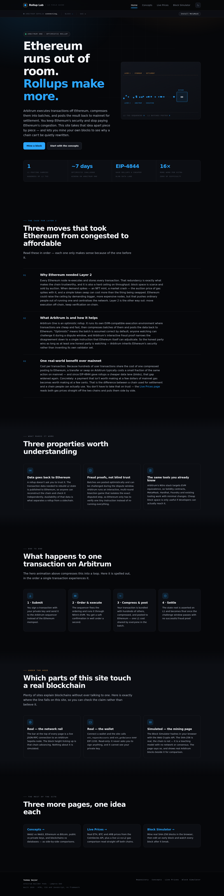
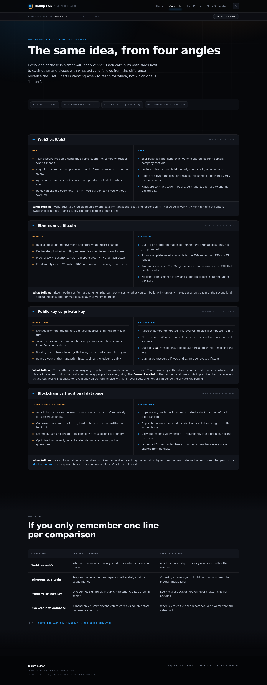
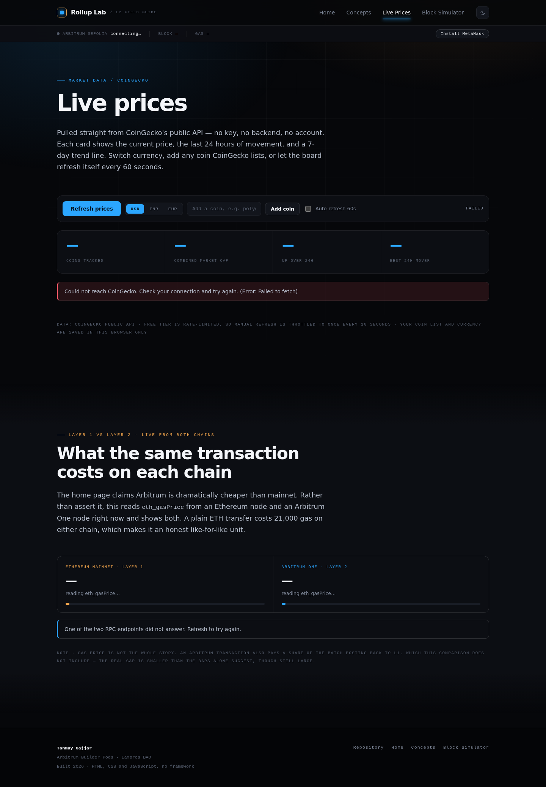
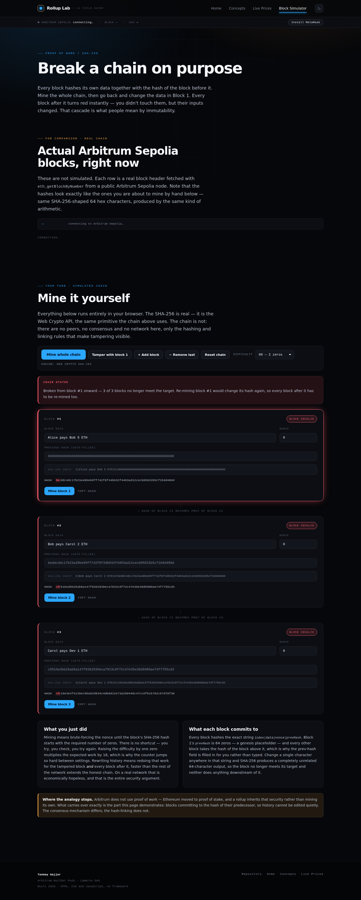

# Rollup Lab — a field guide to Ethereum Layer 2

**Live site → [rollup-lab.vercel.app](https://rollup-lab.vercel.app)**

A four-page website built for the **Arbitrum Builder Pods** assignment (Lampros DAO).
The theme is *Arbitrum / Layer 2 overview*, and every page builds on the same idea: Ethereum
is secure but scarce, rollups make that scarcity affordable, and a chain resists tampering
because each block commits to the one before it.

Plain HTML, CSS and JavaScript. No build step, no framework, no dependencies — not even
ethers.js. Every blockchain call in here is a hand-written JSON-RPC request or a raw EIP-1193
call, because the point of the assignment was to understand the mechanics rather than import
them.



---

## Pages

| # | File | What it does |
|---|------|--------------|
| 1 | `index.html` | Landing page. Hero with an animated rollup batcher (canvas) showing L2 transactions being compressed into a single batch posted to L1, a stat band, a three-step explainer covering why Ethereum needed Layer 2, what Arbitrum is, and one real benefit over mainnet, three feature cards, a four-step transaction lifecycle, an honest breakdown of which parts of the site touch a real chain, and a footer. |
| 2 | `concepts.html` | Four side-by-side comparison cards: Web2 vs Web3, Ethereum vs Bitcoin, public key vs private key, blockchain vs traditional database. A jump bar links straight to each card, and a recap table closes the page with one line per comparison. |
| 3 | `prices.html` | Live crypto dashboard using the CoinGecko public API — price, 24h change with a green/red arrow, a 7-day sparkline and market cap for BTC, ETH, ARB and SOL. Plus a **live L1-vs-L2 gas comparison** read straight off an Ethereum node and an Arbitrum One node. |
| 4 | `simulator.html` | Proof-of-work simulator using real SHA-256 via the Web Crypto API, shown directly beneath a **live feed of real Arbitrum Sepolia blocks** so you can compare the two. Mine each block until its hash starts with N zeros, then edit an earlier block and watch every block after it turn invalid. |

All four pages share one navigation bar, one network rail, one stylesheet and one visual
language. The current page is highlighted in the nav, and on narrow screens the nav collapses
into a menu button.

| Concepts | Live prices | Block simulator |
|---|---|---|
|  |  |  |

---

## What is actually connected to a blockchain

Most "Web3 learning" sites explain blockchains without ever talking to one. This one draws the
line explicitly, on the home page and here:

| Feature | Real or simulated? | How |
|---|---|---|
| **Network rail** (every page) | **Real** | Polls `eth_blockNumber` and `eth_gasPrice` on Arbitrum Sepolia every 6 seconds. The height ticking up is that chain advancing. |
| **Wallet connect** (every page) | **Real** | Raw EIP-1193 over `window.ethereum`. Reads address, chain and balance; can add or switch to Arbitrum Sepolia. |
| **Live block feed** (simulator) | **Real** | `eth_getBlockByNumber` for the last 6 Arbitrum Sepolia block headers — number, hash, timestamp. |
| **Gas comparison** (prices) | **Real** | `eth_gasPrice` from Ethereum mainnet *and* Arbitrum One, scaled against each other. |
| **Crypto prices** (prices) | Real data, **not on-chain** | CoinGecko is an ordinary Web2 REST API. Honest framing: it is a price database, not a chain. |
| **Block mining** (simulator) | **Simulated** | Real SHA-256 via Web Crypto, but no peers, no consensus, no network. A teaching model, labelled as one on the page. |

### The RPC calls, written out

There is no library doing this. A JSON-RPC call is a POST with a JSON body:

```js
await fetch('https://sepolia-rollup.arbitrum.io/rpc', {
  method: 'POST',
  headers: { 'Content-Type': 'application/json' },
  body: JSON.stringify({ jsonrpc: '2.0', id: 1, method: 'eth_blockNumber', params: [] })
});
```

Endpoints used, all public, CORS-enabled and key-free:

| Network | Endpoint |
|---|---|
| Arbitrum Sepolia | `https://sepolia-rollup.arbitrum.io/rpc` |
| Arbitrum One | `https://arb1.arbitrum.io/rpc` |
| Ethereum mainnet | `https://ethereum-rpc.publicnode.com`, falling back to `https://cloudflare-eth.com` |

### The wallet, written out

`assets/js/wallet.js` uses no wallet library. Every interaction is one method name through the
provider the extension injects:

| Method | Used for |
|---|---|
| `eth_requestAccounts` | prompt the user to connect |
| `eth_accounts` | silently reconnect a returning visitor — never prompts |
| `eth_chainId` | detect which network the wallet is on |
| `eth_getBalance` | read the connected account's balance |
| `wallet_switchEthereumChain` | ask the wallet to move to Arbitrum Sepolia |
| `wallet_addEthereumChain` | add the network first if the wallet doesn't know it (error 4902) |

**It is strictly read-only.** The site never requests a signature and never builds a
transaction. This is the Concepts page's public/private key card made concrete: the site
receives an address the wallet chose to reveal and can do nothing else with it.

---

## Project structure

```
rollup-lab/
├── index.html            # Page 1 — home / landing
├── concepts.html         # Page 2 — concept comparisons
├── prices.html           # Page 3 — live prices + L1 vs L2 gas
├── simulator.html        # Page 4 — block simulator + live Arbitrum feed
├── assets/
│   ├── css/
│   │   └── site.css      # single stylesheet shared by all pages
│   └── js/
│       ├── ui.js         # shared: theme, mobile nav, sticky header, scroll reveal
│       ├── chain.js      # JSON-RPC: network rail, live block feed, gas comparison
│       ├── wallet.js     # EIP-1193 wallet connect
│       ├── batcher.js    # hero canvas animation (home)
│       ├── prices.js     # CoinGecko fetching, sparklines, search, currency
│       └── simulator.js  # SHA-256 mining and chain validation
├── screenshots/          # one screenshot per page
└── README.md
```

---

## Run it locally

Everything is static, so there is no install step:

```bash
git clone https://github.com/tanhaker/rollup-lab.git
cd rollup-lab
```

**Recommended — serve over HTTP.** This guarantees the Web Crypto API, the RPC calls and the
CoinGecko fetches all work:

```bash
# Python 3
python -m http.server 5500
# then open http://localhost:5500
```

or use the **Live Server** extension in VS Code and click *Go Live*.

Opening `index.html` by double-clicking also works in Chrome and Firefox, but serving over HTTP
is the safer path. To exercise the wallet features you need a browser wallet such as MetaMask;
without one the chip in the rail reads *Install MetaMask* and everything else still works.

---

## Design system

The visual language is built on one rule: **colour is never decorative.**

| Token | Meaning |
|---|---|
| `--l1` amber | anything happening on Ethereum mainnet / Layer 1 |
| `--l2` blue | anything happening on Arbitrum / Layer 2 |
| `--ok` green | valid, verified, price up |
| `--bad` red | invalid, broken, price down |

That rule holds across the canvas animation (L1 rail amber, L2 lane blue, batches fading from
blue to amber as they settle), the comparison cards, the gas panel and the simulator's block
states. Dark is the default theme; a light theme is available from the toggle in the nav and is
remembered in `localStorage`.

Type is Sora for display, Inter for body, JetBrains Mono for anything that represents machine
output — hashes, addresses, block numbers, labels.

---

## How the block simulator works

Each block commits to the string `index|data|nonce|prevHash`, hashed with SHA-256. The page
shows that exact input string under every block, so you can see what changed.

1. `prevHash` of block 1 is 64 zeros (a genesis placeholder); every other block takes the hash
   of the block above it. The prev-hash field is read-only for that reason — it is derived, not
   typed.
2. **Mining** increments the nonce until the resulting hash starts with the required number of
   leading zeros (2 by default, selectable up to 4). There is no shortcut — it is brute force.
   Each block reports how many attempts it took and the rough hash rate.
3. A block is **valid** only while its hash still meets that prefix.
4. Editing any block's data re-hashes that block, which changes the `prevHash` of the next
   block, which changes its hash, and so on down the chain. One edit invalidates everything
   after it, and the banner at the top names the first broken block.

Each extra required zero multiplies the expected number of attempts by 16, which is why
difficulty 4 takes noticeably longer than difficulty 2.

**Where the analogy stops:** Arbitrum does not use proof of work. Ethereum moved to proof of
stake and a rollup inherits that security rather than mining its own. What carries over exactly
is the hash-linking that this page demonstrates. The page says so rather than letting the
simulation imply otherwise.

---

## Live prices — API notes

Primary request (one call covers everything, including sparklines):

```
https://api.coingecko.com/api/v3/coins/markets?vs_currency=usd&ids=bitcoin,ethereum,arbitrum,solana&sparkline=true&price_change_percentage=24h
```

If that call fails for a reason *other than rate limiting*, the page falls back to the simpler
endpoint suggested in the assignment brief and shows prices without sparklines:

```
https://api.coingecko.com/api/v3/simple/price?ids=ethereum,bitcoin&vs_currencies=usd&include_24hr_change=true
```

On an HTTP 429 it deliberately does **not** fall back — the whole host is rate-limiting the
browser, so a second request would fail the same way and burn another call. The page says so
plainly instead.

Adding a coin goes through `/search?query=` and takes the top match. No API key is needed. The
free tier is rate-limited, so manual refresh is throttled to once every ten seconds,
auto-refresh is capped at one call a minute, and polling pauses while the tab is hidden.

Your tracked coins, chosen currency, auto-refresh preference and colour theme are stored in
`localStorage` — in your browser only, never sent anywhere.

---

## Accessibility and responsiveness

- Skip-to-content link on every page, and a visible focus ring throughout.
- The nav collapses to a labelled menu button under 820px, closes on Escape, and with
  JavaScript disabled the links stay visible rather than becoming unreachable.
- Scroll-reveal, the hero animation, the price flash and the live-block slide-in all respect
  `prefers-reduced-motion`.
- Live regions announce price updates, the chain verdict and new blocks to screen readers.
- Layouts are grid-based and collapse to a single column on phones; the recap table scrolls
  horizontally inside its own container instead of forcing the page to.
- Both themes are checked for contrast, and `color-scheme` is set so form controls follow.

---

## Known issues and what I'd improve

- **Public RPC endpoints are best-effort.** They rate-limit and occasionally drop a request. The
  rail marks itself unreachable after three consecutive failures and the feed keeps the last
  good data on screen rather than blanking; a paid endpoint or a small proxy would be steadier.
- **The gas comparison understates Arbitrum's true cost.** An L2 transaction also pays a share
  of the batch posting back to L1, which `eth_gasPrice` alone doesn't capture. The page states
  this directly under the bars rather than quietly overselling the gap.
- **CoinGecko rate limits.** Refreshing hard can still trigger a 429. The page reports it
  clearly; a small cache or a demo API key would fix it properly.
- **Difficulty 4 blocks the main thread in bursts.** Mining yields to the browser every 500
  attempts to stay responsive; a Web Worker would keep it perfectly smooth.
- **Mined blocks don't persist.** Preferences survive a reload but the chain resets, which is
  deliberate for a teaching page — still, saving it would be a short addition.
- **Fallback hash is not cryptographic.** If `crypto.subtle` is unavailable on the origin, the
  simulator uses a deterministic FNV-1a-based hash so the cascade demo still works. The toolbar
  states which engine is active.
- **Wallet is read-only by design.** No signing, no transactions. The natural next step is an
  Arbitrum Stylus contract in Rust deployed to Sepolia, with this site reading its state — which
  would turn the last simulated piece into a real one.

---

## Author

**Tanmay Gajjar** — Arbitrum Builder Pods, Lampros DAO
GitHub: [@tanhaker](https://github.com/tanhaker) · Repository: [tanhaker/rollup-lab](https://github.com/tanhaker/rollup-lab)
